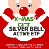
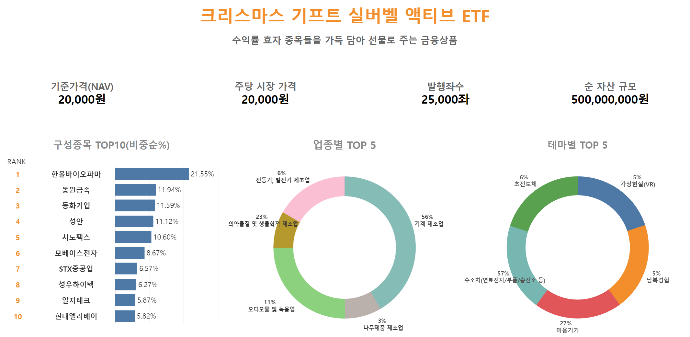
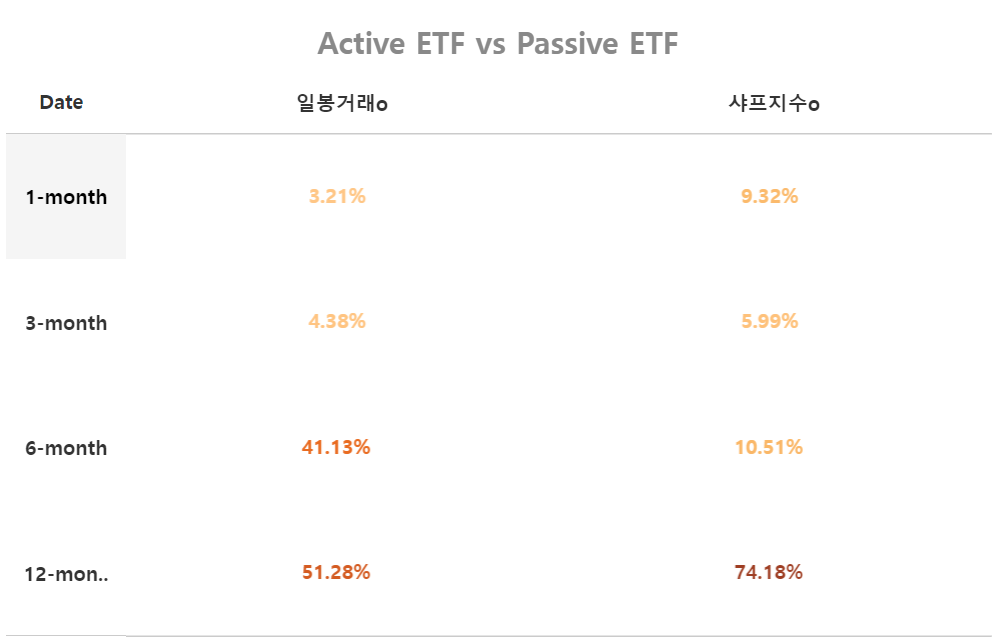
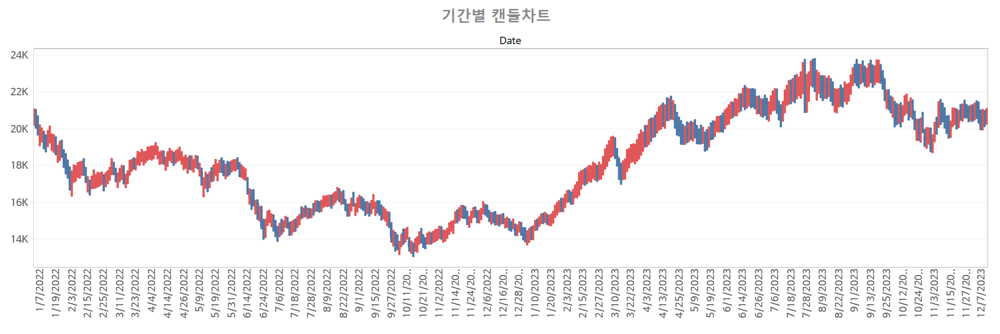
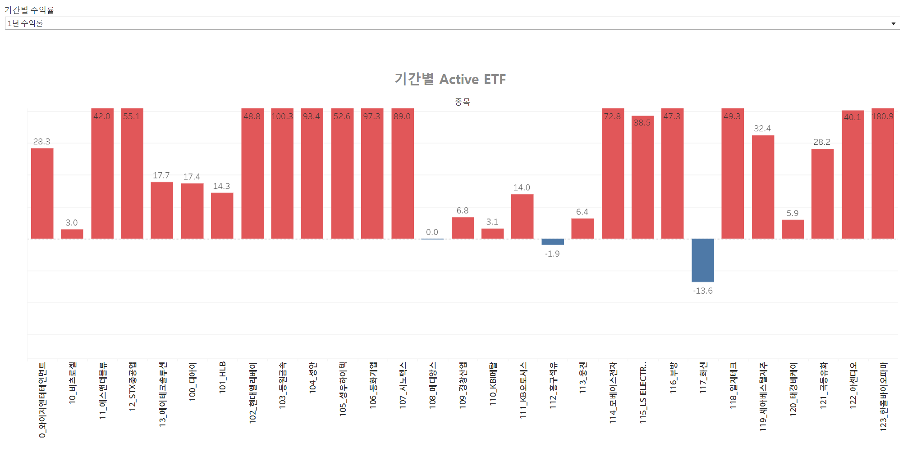

  

## 국내 주식시장의 테마주 기반 ETF 상품 및 주가 예측모델

샤프지수를 고려한 패시브 ETF와 종가예측모델로 펀드매니저가 적극적으로 운용하는 액티브 ETF로 구성된 <b>"하이브리드 ETF 상품"</b> 
tableau 고객향 ETF 소개 페이지에서 종목 분석과 수익율을 확인할 수 있는 대시보드 제공
  

> 액티브 ETF는 기초 지수의 성과를 그대로 추종하는 패시브 ETF와는 달리 기초 지수 대비 초과 수익을 목표로 하는 ETF 입니다. 따라서 기초 지수는 비교 지수(벤치마크)의 역할을 하며, 비교 지수를 상회하는 성과를 내기 위해 투자 종목과 매매 시점을 펀드매니저 재량으로 운용합니다.
낮은 비용, 높은 접근성이라는 ETF의 제도적 장점과 시장 수익률 대비 초과 성과 달성이 가능한 액티브 펀드의 특성이 결합된 상품이라고 볼 수 있습니다. 
<i>출처: tiger ETF (https://www.tigeretf.com/ko/content/activeJustice/content.do)</i>

 
크리스마스 기프트 실버벨 액티브 ETF로 안전성과 추가 수익 두 마리 토끼를 모두 잡으세요!
  

## 📌 프로젝트 정보
- 새싹 청년취업사관학교 용산2기 핀테크 특화 AI 엔지니어 양성과정
- 2차 시계열 에측 프로젝트
- 기간: 2023.12.04 ~ 2023.12.15
- 주제: 국내 주식시장의 테마주 기반 ETF 상품 및 주가 예측모델
- 팀명: 2조 둥둥운용
- 상품명: 둥둥운용 크리스마스 기스트 실버벨 액티브 ETF
- Tableau 대시보드: [크리스마스 기프트 실버벨 액티브 ETF 상품 소개 (링크)](https://public.tableau.com/app/profile/.75987136/viz/Project_17023890534100/ETF)
- PPT: [주식형 ETF 및 주가예측모델 상세 프레젠테이션 파일 (링크)](https://drive.google.com/file/d/11flsHC7XXHnr7EedFPxIjsWYJz1ufSbx/view?usp=drive_link)

 

## 👑 프로젝트 내용

#### 1. 데이터 수집 및 전처리

1. 데이터 수집: `FinanceDataReader` 라이브러리를 활용해 한국거래소 상장종목 데이터 수집
    - 기간: 2016.01.01-2023.11.30
    - 시간 단위: 일자 별 (Day)
    - 종목: 한국 거래소 상장사 1827개

2. 보조지표 추가: `ta` 라이브러리를 활용해 수집한 데이터의 보조지표 연결
3. 결측치 처리: 의심스러운 당기순손실 종목, 투자주의종목 등 투기적이거나 불공정거래의 개연성이 있는 종목을 제외하기 위해 시장의 흐름에서 벗어난 종목 제외
4. 종목 클러스터링: K-means Clustering으로 x(수익율), y(변동성) 기준으로 클러스터링하여 silhouette score 기준으로 최적의 클러스터링 결과 선정
    - 클러스터링 기준 피처: 종가 (Close)
    - X-Axis: 23年 11⽉~ 종가의 평균 수익률 (Mean Return)
    - Y-Axis: 변동성 (표준편차, Volatility)
    - ETF의 기초지수: 한국 거래소 전체 산업군 내 1827개의 상장 종목 대상, 1년 내 종가의 평균 수익율(x)과 변동성(y)을 기준으로 클러스터링하여 가장 높은 수익율(x)과 가장 낮은 변동성(y)에 속한 종목을 그성종목으로 하는 지수. 단, Active ETF 구성종목은 y값이 가장 큰 그룹을 선정함
5. 패시브 ETF 종목 선정: 변동성이 낮고, 수익율이 높은 클러스터 선택하여 클러스터 내 종목을 패시브 ETF 포트폴리오로 구성
    - 종목 구성: SK하이닉스, POSCO홀딩스, 기아 등 242종목
6. 액티브 ETF 종목 선정: 변동성이 높고, 수익율이 높은 클러스터 선택하여 클러스터 내 종목을 액티브 ETF 후보 종목으로 구성, 종목 상장일 기준으로 필터링(2011.11.23 - 2023.12.08)하여 최종 포트폴리오 구성
    - 네이버 증권 테마 이름과 종목 크롤링하여 액티브 ETF 종목에 테마 이름과 매칭
    - 종목 구성: YG엔터테인먼트, 한올바이오파마, 현대엘리베이터 등 124종목

 

#### 2. 샤프지수를 고려한 패시브 ETF

 

#### 3. 트랜스포머 종가예측모델을 사용한 액티브 ETF

1. XGboost 모델을 통한 feature selection: 기본피처 6개 + ta 보조지표 85개로 y(Close)를 예측하는 머신러닝 모델 학습 후 feature importance 상위 지표 추출. 주가예측모델의 feature 후보군으로 선정
2. DataSet: 
    - DoubleAxis DataProcessor으로 다종목 다변수 데이터를 2차원 multivariate 데이터셋으로 변환
    - Sequence Length에 맞춰 시계열 데이터 배치 처리
    - MinMax Scaling으로 피처 정규화
3. Multivariate Cross Attention Transformer 설계 및 학습:
    - Module List에서 N개 종목의 다변수를 병렬 Linear를 통해 output_size 1로 축소
    - Ticker-axis (종목 방향) Attention Transformer: 종목 방향으로 Positional Encoding 후 Performer(transformer) 연산
    - Time-axis (시간 방향) Attention Transformer: 시간 방향으로 Posotional Encoding 후 Performer (transformer) 연산
    - Mean Pooling으로 N개 종목의 직전 K일로부터 향후 1일을 각각 예측
4. 하이퍼파라미터 튜닝:
    - 모델 하이퍼파라미터에서는 종목 수, sequence length, batch, LR, Epoch 등 실험
    - Performer 트랜스포머 파라미터에서는 dim, deepth, head, dim_head를 변경해 실험
    - 30개 종목은 직전 10일로 향후 1일 예측하는 것이 유리, 50개 종목은 직전 6-8일로 향후 1일 예측하는 것이 유리

 

#### 4. 모델 비교 및 성능평가
Bi-Directional LSTM과 Transformer 모델 비교

1. 동일종목의 MAE, MSE, RMSE 비교
2. LSTM 모델에서 관측되는 Time Lag 현상이 Transformer 모델에서는 발생하지 않아 트랜스포머의 성능이 더 우수

 

#### 5. 수익율 계산 및 백테스트
패시브 ETF 포트폴리오와 액티브 ETF 포트폴리오의 기간 별 수익율 백테스트

1. 패시브 ETF: <b>샤프지수</b> 적용 여부에 따라 1년, 6개월, 3개월, 1개월 보유 기간 동안 수익율 계산
2. 액티브 ETF: <b>일봉거래</b> 적용 여부에 따라 1년, 6개월, 3개월, 1개월 보유 기간 동안 수익율 계산

 

#### 6. Tableau 대시보드

고객에게 ETF 상품을 소개하기 위한 대시보드로 종목 분석과 기간 별 수익율, 종목별 수익 비중 등을 디스플레이

1. ETF 기본 정보 및 구성 종목 분석:
    - 기준가격(NAV), 발행좌수 등 주요 정보 상단 배치
    - 포트폴리오 별 비율 TOP 10 bar chart, 업종별, 테마별 pie chart
2. 패시브 ETF와 액티브 ETF의 기간별 수익율 분석:
    - 액티브 ETF에 일봉거래 전략과 패시브 ETF에 샤프지수를 도입한 종목별 보유비율 리밸런싱 적용한 경우의 기간별 수익율 분석
    - 액티브 ETF의 종목별 수익율 분석 트리맵
    - 기간별 패시브, 액티브 ETF의 수익율 line chart
3. 포트폴리오 종목 주가 캔들차트 및 종목별 수익율 시각화

  

## 🍉 기술 스택

 

## 👶 팀원 소개

<table border="" cellspacing="0" cellpadding="0" max-width="2000px">
    <tr width="100%">
        <td align="center"><a href= "https://github.com/yunariver">강윤하</a></td>
        <td align="center"><a href= "https://github.com/KimJuyoung23">김주영</a></td>
        <td align="center"><a href= "https://github.com/seyeon-shijuan">박세연</a></td>
        <td align="center"><a href= "https://github.com/JangMinJung">장민정</a></td>
        <td align="center"><a href= "https://github.com/Minnie02">전민지</a></td>
    </tr>
    <tr width="100%">
        <td align="center">
          
        </td>
        <td align="center">
          
        </td>
        <td align="center">
          
        </td>
        <td align="center">
          
        </td>
        <td align="center">
          
        </td>
    </tr>
    <tr width="100%">
      <td align="center">
        <small>
        프로젝트 발표 
        LSTM/TF 성능비교 
        논문분석&아키텍처
        </small>
      </td>
      <td align="center">
        <small>
        종목 클러스터링 
        샤프지수 PF최적화 
        패시브ETF 백테스트
        </small>
      </td>
      <td align="center">
        <small>
        XGboost 피처셀렉션 
        트랜스포머 예측모델 
        액티브ETF 백테스트
        </small>
      </td>
      <td align="center">
        <small>
        테마주 수집 
        TA 지표 분석 
        시계열 모델 조사
        </small>
      </td>
      <td align="center">
        <small>
        Tableau 대시보드 
        ETF 분석&수익율 
        주가차트분석
        </small>
      </td>
   </tr>
</table>

 

## ✨ Tableau Dashboard

  <h3>ETF 기본 정보 및 구성 종목 분석</h3>

||
|:-:|
||

  <h3>패시브 ETF와 액티브 ETF의 기간별 수익율 분석</h3>

||
|:-:|
||
||

  <h3>포트폴리오 종목 주가 캔들차트 및 종목별 수익율 시각화</h3>

||
|:-:|
||
||

